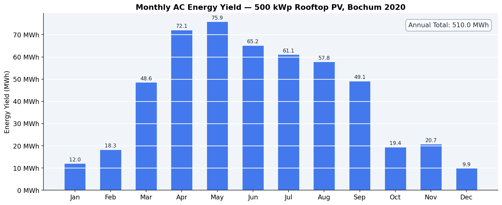
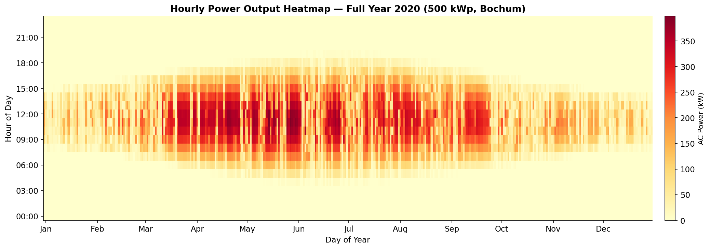
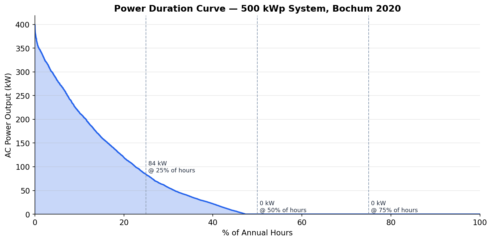
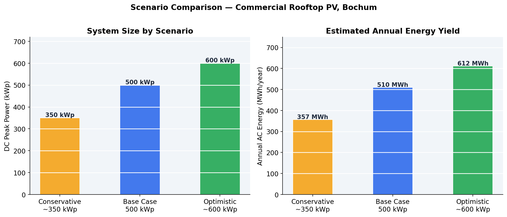
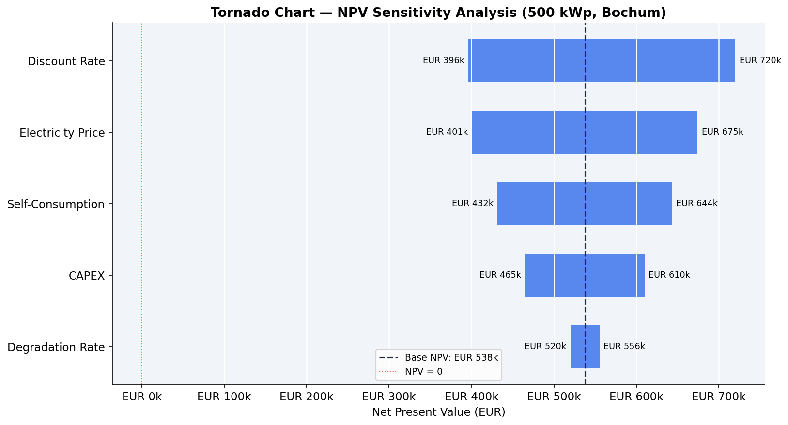
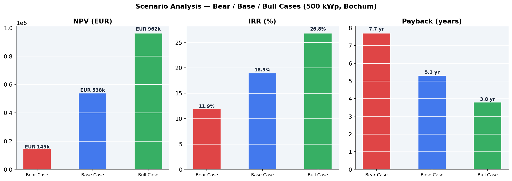
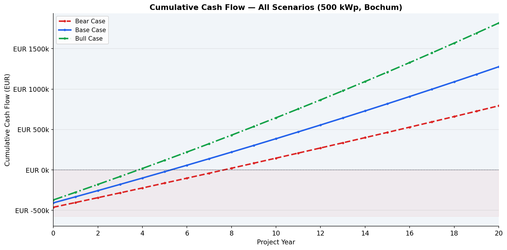

# 🔆 Commercial Rooftop PV Investment Decision Tool

[](https://python.org)
[](https://pvlib-python.readthedocs.io)
[](LICENSE)
[]()

A **reproducible, data-driven investment decision tool** for a 500 kWp commercial
rooftop PV system in Bochum, NRW, Germany — modelled under EEG 2023 regulations
with full financial analysis, sensitivity testing, and a Go/No-Go recommendation.

> Built as a portfolio project during MSc Mechanical Engineering  
> (Sustainable Energy Systems & Circular Process Engineering) — Ruhr University Bochum

---

## 📋 Project Brief

> *"Given a commercial rooftop in Germany with defined structural, grid, and budget
> constraints, simulate energy yield, model financial viability under EEG 2023,
> and deliver a data-backed Go/No-Go investment recommendation for a ~500 kWp system."*

| Parameter | Value |
|---|---|
| Location | Bochum, NRW (51.48°N, 7.22°E) |
| System Size | 500 kWp DC / ~400 kW AC |
| Budget Constraint | EUR 400,000 – 600,000 |
| Roof Load Limit | 15 kg/m² |
| Grid Connection | 630 kVA transformer |
| Minimum Payback | ≤ 8 years |
| Regulation | EEG 2023 (Erneuerbare-Energien-Gesetz) |

---

## ✅ Investment Verdict

| KPI | Result | Threshold | Status |
|---|---|---|---|
| NPV (6% discount rate) | **EUR 537,723** | > 0 | ✅ |
| IRR | **18.94%** | > 8% | ✅ |
| Simple Payback | **5.3 years** | ≤ 8 years | ✅ |
| LCOE | **9.84 ct/kWh** | < grid price | ✅ |
| CAPEX | **EUR 407,400** | EUR 400k–600k | ✅ |

**→ GO — Investment recommended. Verdict holds across Bear, Base and Bull scenarios.**

---

## 📊 Key Results

### Energy Yield (pvlib PVWatts Simulation)
| Metric | Value | Benchmark |
|---|---|---|
| Annual AC Yield | 510 MWh/year | — |
| Specific Yield | 1,020 kWh/kWp | 850–1,050 ✅ |
| Performance Ratio | 0.811 | > 0.75 ✅ |
| Peak AC Power | 398.6 kW | < 500 kWp ✅ |
| 20-Year Total Yield | 9,822 MWh | — |

### Scenario Analysis
| Scenario | CAPEX | NPV | IRR | Payback | Verdict |
|---|---|---|---|---|---|
| Bear Case | EUR 462k | EUR 145k | 11.9% | 7.7 yr | ✅ GO |
| Base Case | EUR 407k | EUR 538k | 18.9% | 5.3 yr | ✅ GO |
| Bull Case | EUR 371k | EUR 962k | 26.8% | 3.8 yr | ✅ GO |

---

## 📈 Visualisations

### Monthly Energy Yield


### Annual Generation Heatmap


### Power Duration Curve


### Scenario Comparison


### Sensitivity — Tornado Chart


### Bear / Base / Bull Scenarios


### Cumulative Cash Flow


---

## 🗂️ Repository Structure
```
solar-pv-investment-tool/
│
├── data/
│   ├── raw/               # PVGIS API hourly irradiance data
│   └── processed/         # Simulation results, financial model outputs
│
├── notebooks/             # Jupyter notebooks (planned)
│
├── src/
│   ├── data_fetcher.py        # PVGIS API client
│   ├── pvlib_simulation.py    # PVWatts energy yield model
│   ├── roof_constraint.py     # Structural feasibility analysis
│   ├── smard_fetcher.py       # German electricity price model
│   ├── financial_model.py     # NPV, IRR, LCOE, cash flow model
│   ├── sensitivity.py         # Sensitivity & scenario analysis
│   └── visualise_yield.py     # Chart generation
│
├── outputs/
│   ├── figures/           # All generated charts (PNG)
│   └── reports/           # HTML investment dashboard
│
├── tests/                 # Unit tests (planned)
└── requirements.txt       # Python dependencies
```

---

## 🛠️ Methodology

### 1. Solar Resource Data
Hourly irradiance and meteorological data fetched from the
**PVGIS API** (EU Joint Research Centre) for Bochum, NRW —
the authoritative European solar radiation database used in
commercial PV feasibility studies.

### 2. Energy Yield Simulation
AC power output simulated using **pvlib's PVWatts model** —
an industry-validated simplified model developed by NREL.
Applies cell temperature correction (Faiman model), system
losses (14%), and inverter efficiency (96%).

### 3. Structural Feasibility
Roof load analysis using panel weight, aerodynamic ballasted
mounting system, and Ground Coverage Ratio (GCR = 0.45).
500 kWp confirmed feasible at 5.77 kg/m² — well within the
15 kg/m² structural limit.

### 4. Financial Model
20-year discounted cash flow model with:
- Two revenue streams: self-consumption savings + EEG feed-in tariff
- Annual panel degradation (0.4%/yr)
- OPEX escalation (2%/yr)
- 2% electricity price escalation
- WACC of 6% (60% KfW debt @ 3.5% + 40% equity @ 10%)

### 5. Sensitivity Analysis
One-way sensitivity on 5 key parameters (±20% CAPEX,
±15% electricity price, self-consumption ratio, degradation
rate, discount rate). Bear/Base/Bull scenario analysis with
coherent assumption sets.

---

## 🚀 Getting Started

### Prerequisites
- Python 3.11+
- Conda or venv

### Installation
```bash
# Clone the repository
git clone https://github.com/felixokumo1-stack/solar-pv-investment-tool.git
cd solar-pv-investment-tool

# Create and activate environment
conda create -n solar-pv python=3.11
conda activate solar-pv

# Install dependencies
pip install -r requirements.txt
```

### Run the Full Analysis
```bash
# 1. Fetch solar data from PVGIS
python src/data_fetcher.py

# 2. Simulate energy yield
python src/pvlib_simulation.py

# 3. Structural feasibility
python src/roof_constraint.py

# 4. Electricity price model
python src/smard_fetcher.py

# 5. Financial model
python src/financial_model.py

# 6. Sensitivity analysis
python src/sensitivity.py

# 7. Generate charts
python src/visualise_yield.py
```

Then open `outputs/reports/investment_dashboard.html` in any browser.

---

## 📦 Dependencies
```
pvlib==0.15.0
pandas
numpy
matplotlib
plotly
requests
openpyxl
notebook
```

Install all with:
```bash
pip install -r requirements.txt
```

---

## 🔮 Planned Extensions (v2.0)

- [ ] **BESS Integration** — Battery dispatch model for increased
      self-consumption optimisation
- [ ] **Multi-site comparison** — Compare multiple rooftop locations
- [ ] **Jupyter notebooks** — Narrative walkthrough of full methodology
- [ ] **Unit tests** — Pytest suite for all financial model functions
- [ ] **CI/CD** — GitHub Actions workflow for automated testing

---

## 📚 Data Sources & References

| Source | Usage |
|---|---|
| [PVGIS (EU JRC)](https://re.jrc.ec.europa.eu/pvg_tools/) | Solar irradiance data |
| [pvlib](https://pvlib-python.readthedocs.io) | PV simulation library |
| [SMARD.de](https://www.smard.de) | German electricity market data |
| [BDEW Strompreisanalyse](https://www.bdew.de) | Commercial electricity price benchmarks |
| [EEG 2023](https://www.gesetze-im-internet.de/eeg_2023/) | Feed-in tariff regulation |
| [BSW Solar](https://www.bsw-solar.de) | CAPEX benchmarks |
| [Bundesnetzagentur](https://www.bundesnetzagentur.de) | Grid connection standards |

---

## 📄 License

MIT License — see [LICENSE](LICENSE) for details.

---

## 👤 Author

**Felix Okumo**  
MSc Mechanical Engineering — Sustainable Energy Systems & Circular Process Engineering  
Ruhr University Bochum  
[GitHub](https://github.com/felixokumo1-stack)